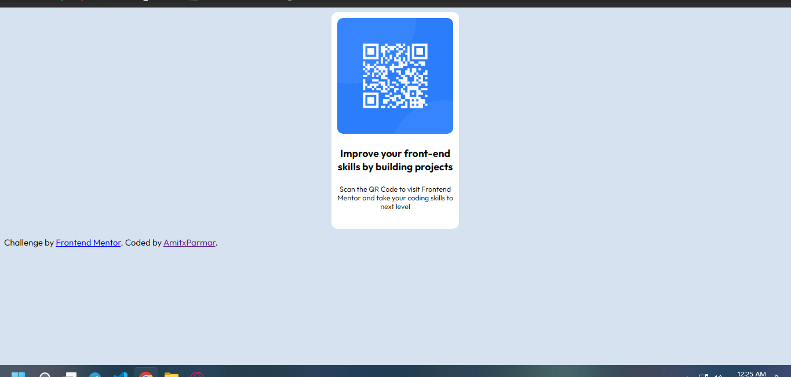

# Frontend Mentor - QR code component solution

This is a solution to the [QR code component challenge on Frontend Mentor](https://www.frontendmentor.io/challenges/qr-code-component-iux_sIO_H). Frontend Mentor challenges help you improve your coding skills by building realistic projects. 

## Table of contents

- [Frontend Mentor - QR code component solution](#frontend-mentor---qr-code-component-solution)
  - [Table of contents](#table-of-contents)
  - [Overview](#overview)
    - [Screenshot](#screenshot)
    - [Built with](#built-with)
    - [What I learned](#what-i-learned)
    - [Useful resources](#useful-resources)
  - [Author](#author)

**Note: Delete this note and update the table of contents based on what sections you keep.**

## Overview
I built this Beginner Project Using pure HTML and CSS. No other tools were used.

### Screenshot

### Built with

- HTML5
- CSS

### What I learned

In this Challenge I learned about how design a component and its margin, padding and alignment.

### Useful resources
This CSS grid guide helped me alot building the component design: [https://www.w3schools.com/css/css_grid.asp]

How to use Google fonts [https://linuxhint.com/google-fonts-html/]

helped me making my component move to center [https://www.w3.org/Style/Examples/007/center.en.html#:~:text=Centering%20a%20block%20or%20image&text=The%20way%20to%20do%20that,up%20all%20the%20available%20width.]

The way one should Submit their solution: [https://medium.com/frontend-mentor/a-complete-guide-to-submitting-solutions-on-frontend-mentor-ac6384162248]

## Author

- Frontend Mentor - [@AmitxParmar](https://www.frontendmentor.io/profile/yourusername)

